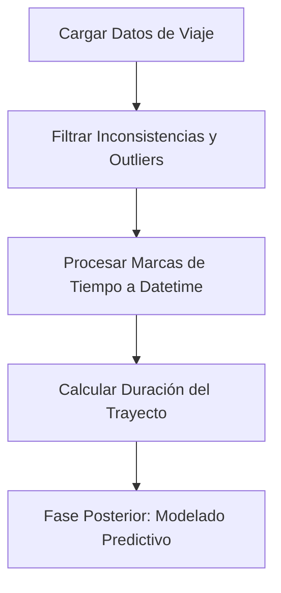

# 🚕 Proyecto Automatidata — Análisis de Taxis Amarillos de NYC (2017)

Este repositorio contiene la fase inicial del proyecto de consultoría de datos desarrollado por **Automatidata** para la **Comisión de Taxis y Limusinas de la Ciudad de Nueva York (NYC TLC)**. El objetivo principal es inspeccionar, limpiar y preparar el conjunto de datos de viajes de taxi del año 2017 para construir un modelo predictivo que estime las tarifas de taxi de manera precisa.

El proyecto está estructurado bajo el marco de resolución de problemas **PACE** (*Planear, Analizar, Construir y Ejecutar*).

---

## 📋 Estructura del Repositorio

* **[Automatidata_Laboratorio_Python_ES.ipynb](Automatidata_Laboratorio_Python_ES.ipynb)**: Cuaderno de Jupyter estructurado con el código en Python para la exploración, filtrado y primeras estadísticas descriptivas del conjunto de datos.
* **[2017_Yellow_Taxi_Trip_Data.csv](2017_Yellow_Taxi_Trip_Data.csv)**: Conjunto de datos en formato CSV con los registros detallados de los viajes de taxi.
* **[images/](images/)**: Recursos visuales que ilustran el flujo y las etapas metodológicas de PACE utilizadas en el proyecto.

---

## 🎯 Objetivos del Proyecto

1. **Exploración y Diagnóstico (EDA):** Analizar la calidad de los datos para identificar anomalías operativas y registros con valores incoherentes.
2. **Análisis de Relaciones:** Investigar cómo se distribuyen las métricas clave (duración, distancia, tarifas y propinas) según el método de pago y el proveedor de servicio.
3. **Preparación para el Modelado:** Establecer las bases analíticas y la limpieza necesarias para el posterior entrenamiento de un modelo predictivo que estime la tarifa base de los trayectos.

---

## 📊 Diagnóstico y Estadísticas Clave de los Datos

Tras inspeccionar el dataset de 2017, se identificaron los siguientes aspectos relevantes de calidad de datos (EDA):

* **Completitud:** El dataset consta de **22,699 filas y 18 variables**, con un 100% de registros completos (cero valores nulos).
* **Distribución de Proveedores (VendorID):**
  * `VendorID 2` (Verifone): **12,626** viajes (55.6%)
  * `VendorID 1` (Creative Mobile Technologies): **10,073** viajes (44.4%)
* **Métodos de Pago (payment_type):**
  * Tarjetas de Crédito (`1`): **15,265** viajes. Promedio de propina de **$2.73**.
  * Efectivo (`2`): **7,267** viajes. Promedio de propina de **$0.00**.

> [!NOTE]
> Las propinas pagadas en efectivo no se registran en los sistemas electrónicos de la TLC. El promedio de propina registrado de $0.00 en efectivo refleja la ausencia de registros de este método y no necesariamente que no se hayan dado propinas.

---

## ⚠️ Anomalías Detectadas (Valores Atípicos)

Para asegurar el **rigor analítico**, se identificaron las siguientes inconsistencias en el conjunto de datos que deben ser tratadas antes de entrenar un modelo predictivo:

1. **Tarifas Negativas:** Se detectaron 14 viajes con cobros negativos (mínimo de `-$120.30`), representando devoluciones o disputas de cobro.
2. **Distancias en Cero:** 148 registros registran una distancia de viaje de `0.0` millas a pesar de tener cobros positivos en la tarifa.
3. **Duraciones de Viaje Incoherentes:**
    * Hay 1 viaje con duración negativa (`-16.98 minutos`) por errores en el ingreso de marcas de tiempo.
    * 26 viajes registran una duración de `0.0` minutos.
    * Varios viajes presentan duraciones de hasta `24 horas`, probablemente debido a taxímetros abiertos o fallas del sistema.

---

## 🛠️ Metodología PACE Aplicada

El flujo de trabajo analítico y los próximos pasos del proyecto se estructuran bajo las etapas de PACE:

1. **Plan (Planificar):** Comprender los requerimientos de la NYC TLC para predecir tarifas e identificar las variables disponibles en el conjunto de datos.
2. **Analyze (Analizar):** Cargar los datos, examinar su completitud y distribuciones estadísticas. Identificar valores atípicos y patrones inconsistentes mediante análisis exploratorio.
3. **Construct (Construir):**
   * Limpiar el dataset eliminando los registros atípicos identificados en la etapa de análisis (tarifas negativas, distancias o duraciones nulas o erróneas).
   * Diseñar características nuevas a partir de variables temporales para calcular duraciones en minutos y segmentación por horarios y días.
4. **Execute (Ejecutar):** Formular respuestas analíticas del negocio y planificar la creación de modelos de regresión predictivos de tarifas base.



---

## 🛠️ Requisitos e Instalación

Para ejecutar el cuaderno de análisis localmente, asegúrate de tener instalado Python 3.x y las siguientes librerías de manipulación de datos:

```bash
pip install pandas numpy
```

Abre tu entorno de Jupyter Notebook o JupyterLab y ejecuta [Automatidata_Laboratorio_Python_ES.ipynb](Automatidata_Laboratorio_Python_ES.ipynb).
