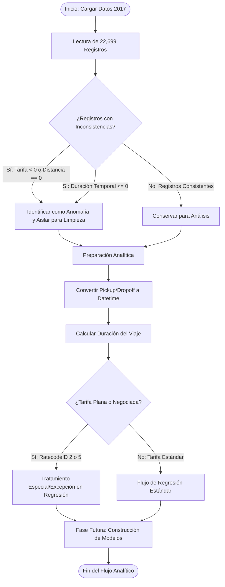

# 🚕 Proyecto Automatidata — Análisis de Taxis Amarillos de NYC (2017)

Este repositorio contiene la fase inicial del proyecto de consultoría de datos desarrollado por **Automatidata** para la **Comisión de Taxis y Limusinas de la Ciudad de Nueva York (NYC TLC)**. El objetivo principal de esta etapa fue inspeccionar, limpiar y realizar un Análisis Exploratorio de Datos (EDA) sobre el conjunto de viajes del año 2017. Esta exploración establece las bases analíticas necesarias para el desarrollo posterior de un modelo predictivo capaz de estimar las tarifas de taxi de manera precisa.

El proyecto se estructuró bajo el marco de resolución de problemas **PACE** (*Planear, Analizar, Construir y Ejecutar*).

---

## 📋 Estructura del Repositorio y Guía de Inicio

Para comprender y reproducir este análisis de forma óptima, se recomienda explorar los archivos en el siguiente orden:

1. **[requirements.txt](requirements.txt)**: Archivo con las dependencias del sistema y librerías necesarias con sus respectivas versiones para garantizar la reproducibilidad del entorno de ejecución.
2. **[Automatidata_Laboratorio_Python_ES.ipynb](Automatidata_Laboratorio_Python_ES.ipynb)**: Cuaderno de Jupyter principal. Contiene el código en Python estructurado paso a paso para la carga, filtrado, exploración estadística y visualización descriptiva de los datos. **Este es el archivo principal a abrir.**
3. **[2017_Yellow_Taxi_Trip_Data.csv](2017_Yellow_Taxi_Trip_Data.csv)**: Conjunto de datos original en formato CSV que contiene una muestra representativa de 22,699 registros de viajes con 18 variables analíticas.
4. **[images/](images/)**: Carpeta que contiene los recursos visuales y esquemas metodológicos que guían el flujo de trabajo de la metodología PACE.

---

## 🎯 Objetivos del Proyecto

1. **Exploración y Diagnóstico (EDA):** Analizar la calidad del conjunto de datos e identificar anomalías operativas y registros inconsistentes.
2. **Análisis de Relaciones:** Investigar la distribución de las métricas de negocio (distancia, tarifa, propinas y duración) en función de variables categóricas como proveedores y métodos de pago.
3. **Preparación Analítica:** Definir los criterios de limpieza y transformaciones requeridas antes del modelado predictivo de regresión.

---

## 📊 Diagnóstico y Estadísticas Clave de los Datos

La exploración inicial del dataset reveló las siguientes estadísticas descriptivas fundamentales:

* **Volumen y Completitud:** El dataset consta de **22,699 registros y 18 columnas**, sin presencia de valores nulos (100% de completitud).
* **Distribución de Proveedores (VendorID):**
  * `VendorID 2` (Verifone): **12,626 viajes** (55.6% del mercado).
  * `VendorID 1` (Creative Mobile Technologies): **10,073 viajes** (44.4% del mercado).
* **Comportamiento de Transacciones (payment_type):**
  * Tarjetas de Crédito (`1`): **15,265 viajes** con un promedio de propina registrada de **$2.73**.
  * Efectivo (`2`): **7,267 viajes** con un promedio de propina registrada de **$0.00**.

> [!NOTE]
> Las propinas pagadas en efectivo no se registran en los sistemas electrónicos de la TLC. Por lo tanto, el promedio de $0.00 en efectivo refleja la ausencia de registros analíticos de este método y no necesariamente que los clientes no hayan otorgado propina.

---

## ⚠️ Anomalías y Hallazgos de Calidad de Datos

Durante la fase de diagnóstico se identificaron anomalías operativas críticas que afectarán directamente al modelo predictivo si no se tratan adecuadamente:

1. **Tarifas Negativas:** Se detectaron 14 viajes con valores de tarifa negativos (mínimo de `-$120.30`), los cuales representan devoluciones, disputas o errores de cobro.
2. **Distancias en Cero:** 148 viajes registraron una distancia de `0.0` millas a pesar de tener montos de cobro positivos asociados, lo cual sugiere fallas de GPS o tarifas mínimas fijadas manualmente.
3. **Duraciones de Viaje Incoherentes:**
   * 1 viaje registró duración negativa (`-16.98 minutos`) debido a errores en la captura de marcas de tiempo.
   * 26 viajes registraron duraciones de exactamente `0.0` minutos.
   * Se identificaron viajes con duraciones atípicas de hasta `24 horas` debido a taxímetros abiertos o fallas del sistema del vehículo.
4. **Monto Máximo Atípico:** Un cobro total de `$1,200.29` para un viaje relativamente corto, lo que representa un valor atípico de alta influencia que requiere tratamiento o exclusión.

---

## 💡 Resultados y Conclusiones de Negocio (Insights para la NYC TLC)

Tras concluir el análisis exploratorio, se presentan las siguientes conclusiones clave orientadas al negocio:

### 1. Sesgo en la Variable de Propinas (`tip_amount`)

Existe una marcada diferencia en el registro de propinas según el tipo de pago. Para modelar el comportamiento del ingreso total de los conductores o las tarifas reales, **la NYC TLC no debe utilizar la variable `tip_amount` sin controlar el método de pago**. Dado que las propinas en efectivo no se reportan en los sistemas digitales (registrando un promedio sesgado de $0.00), el uso crudo de esta variable distorsionaría cualquier modelo predictivo.

### 2. Homogeneidad de Tarifas entre Proveedores

A pesar de que Verifone (`VendorID 2`) tiene una participación mayoritaria de viajes (55.6%) en comparación con Creative Mobile Technologies (`VendorID 1`) (44.4%), el cobro promedio final por viaje es extremadamente similar:

* **Vendor 1:** Monto promedio de **$16.30** por trayecto.
* **Vendor 2:** Monto promedio de **$16.32** por trayecto.
Esto concluye que el mercado está equilibrado tarifariamente y la elección del proveedor tecnológico no introduce variaciones significativas en la facturación promedio de los taxis.

### 3. Excepciones de Correlación Tarifa-Distancia

Aunque la distancia (`trip_distance`) es el predictor intuitivo más fuerte para estimar la tarifa base, existen dos escenarios que rompen la linealidad y deben parametrizarse en el modelo predictivo:

* **Tarifas Planas (RatecodeID 2):** Viajes recurrentes como el trayecto hacia/desde el Aeropuerto JFK que operan bajo una tarifa base fija de **$52.00**, independientemente del tráfico o de la distancia exacta recorrida.
* **Tarifas Negociadas (RatecodeID 5):** Viajes de larga distancia cobrados bajo acuerdo previo (por ejemplo, el viaje registrado de 33.9 millas cobrado a **$150.00**), que requieren un tratamiento o filtrado especial durante la fase de entrenamiento del modelo.

---

## 🛠️ Metodología PACE Aplicada

El flujo del proyecto se divide en fases ejecutadas en este repositorio y las planificadas a futuro para completar el desarrollo del modelo predictivo:

### 1. Planear (Fase Completada)

* Se definieron las preguntas de negocio de la NYC TLC y se delimitó el alcance analítico.
* Se identificaron las variables de entrada del dataset de 2017 y sus tipos de datos correspondientes.

### 2. Analizar (Fase Completada)

* Se cargaron los datos en Python y se evaluó la completitud y consistencia del dataset.
* Se aislaron valores atípicos y se estructuraron las anomalías de calidad de datos.
* Se generaron las conclusiones descriptivas y los insights de negocio (propinas y proveedores).

### 3. Construir (Plan de Acción Futuro)

* Se eliminarán los registros atípicos identificados en la fase de análisis (tarifas negativas, distancias o duraciones incoherentes).
* Se diseñarán nuevas características predictivas extraídas a partir de las marcas de tiempo (`tpep_pickup_datetime` y `tpep_dropoff_datetime`), calculando la duración del viaje en minutos y segmentándola por hora del día y día de la semana.
* Se entrenará y validará un modelo de regresión predictivo utilizando la librería `scikit-learn`.

### 4. Ejecutar (Plan de Acción Futuro)

* Se presentará el rendimiento del modelo final de predicción de tarifas a las partes interesadas de la NYC TLC.
* Se desplegarán los resultados y recomendaciones de optimización operativa para la flota de taxis de la ciudad.

### Diagrama de Decisiones del Flujo Analítico

El siguiente diagrama detalla cómo se bifurca el procesamiento de datos durante el análisis exploratorio y la preparación para la limpieza:



---

## ⚙️ Requisitos e Instalación

### 1. Clonar el repositorio

```bash
git clone https://github.com/tu-usuario/Laboratorio-del-proyecto-Automatidata.git
```

### 2. Instalar dependencias

Asegúrate de tener instalado Python 3.7+ y ejecuta el siguiente comando para instalar las librerías necesarias especificadas en [requirements.txt](requirements.txt):

```bash
pip install -r requirements.txt
```

### 3. Iniciar Jupyter Notebook

Una vez instaladas las dependencias, inicia tu servidor local y ejecuta el notebook:

```bash
jupyter notebook
```

Abre el archivo [Automatidata_Laboratorio_Python_ES.ipynb](Automatidata_Laboratorio_Python_ES.ipynb) para visualizar el análisis.

---

## 👤 Autor y Contacto

Este proyecto fue desarrollado como parte de un portafolio profesional en ciencia de datos.

* **Portafolio Personal:** [nilsonpineres.me](https://nilsonpineres.me)
* **LinkedIn:** [Nilson Piñeres](https://www.linkedin.com/in/prs-mtz)
* **GitHub:** [@NilsonPM](https://github.com/NilsonPM)
